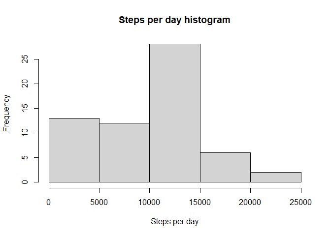
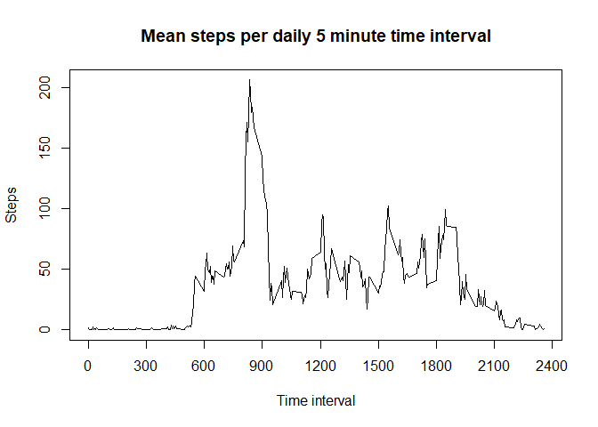
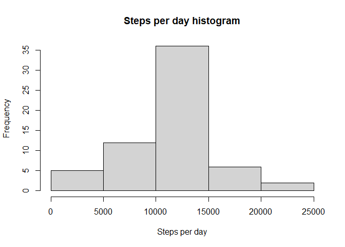
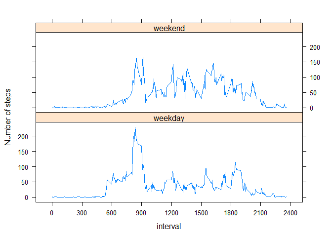

## Loading and preprocessing the data

```r
library(xtable)
library(dplyr)
library(stringr)
library(lattice)
```


```r
activity<-read.csv(unz("activity.zip","activity.csv"))
```

## What is mean total number of steps taken per day?
A data set of the raw data for total steps per day is created below:

```r
steps.per.day<-activity %>% group_by(date) %>% summarise(total.steps=sum(steps,na.rm=TRUE))
```
  
A histogram using this data set of the frequency of total steps per day per bin of 5,000 steps is below:
  

```r
hist(steps.per.day$total.steps,xlab="Steps per day",main="Steps per day histogram")
```

<!-- -->


The mean number of total steps per day is 9,354 while the median number of total steps per day is 10,395.

## What is the average daily activity pattern?
A time series plot of the average daily activity pattern is calculated and shown below:


```r
steps.per.interval.mean<-activity %>% group_by(interval) %>% summarise(total.steps=mean(steps,na.rm=TRUE))
with(steps.per.interval.mean,plot(interval,total.steps,type="l",main="Mean steps per daily 5 minute time interval",xlab="Time interval",ylab="Steps",xaxt="n"))
axis(1,at=seq(0,2400,300))
```

<!-- -->


The maximum average number of steps for a 5 minute time interval is 206 which occurs in the interval beginning at 0835.

## Imputing missing values
From an inspection of the data, there are a number of NA values for the steps taken. A table of how many of these NA values there are for each day when there are any NA values is shown below.


```r
steps.NA<-t(table(is.na(activity$steps),activity$date))
steps.NA<-steps.NA[steps.NA[,2]!=0,]
print(xtable(steps.NA),type="html")
```

<!-- html table generated in R 4.0.2 by xtable 1.8-4 package -->
<!-- Wed Oct 28 14:25:51 2020 -->
<table border=1>
<tr> <th>  </th> <th> FALSE </th> <th> TRUE </th>  </tr>
  <tr> <td align="right"> 2012-10-01 </td> <td align="right">   0 </td> <td align="right"> 288 </td> </tr>
  <tr> <td align="right"> 2012-10-08 </td> <td align="right">   0 </td> <td align="right"> 288 </td> </tr>
  <tr> <td align="right"> 2012-11-01 </td> <td align="right">   0 </td> <td align="right"> 288 </td> </tr>
  <tr> <td align="right"> 2012-11-04 </td> <td align="right">   0 </td> <td align="right"> 288 </td> </tr>
  <tr> <td align="right"> 2012-11-09 </td> <td align="right">   0 </td> <td align="right"> 288 </td> </tr>
  <tr> <td align="right"> 2012-11-10 </td> <td align="right">   0 </td> <td align="right"> 288 </td> </tr>
  <tr> <td align="right"> 2012-11-14 </td> <td align="right">   0 </td> <td align="right"> 288 </td> </tr>
  <tr> <td align="right"> 2012-11-30 </td> <td align="right">   0 </td> <td align="right"> 288 </td> </tr>
   </table>

The pattern is clearly that for any given day all the values are NA or none of the values are NA. Since there is therefore no way to impute steps from data on the same day, I have imputed the data for those days where the steps values are NA on the basis of the mean for that time period over the non-NA days. After the code below is a histogram of the steps per day for the new dataset with the NAs imputed.


```r
activity.no.NA<-inner_join(activity,steps.per.interval.mean,by=c("interval"="interval")) %>% mutate(steps=coalesce(steps,round(total.steps)))
steps.per.day.no.NA<-activity.no.NA %>% group_by(date) %>% summarise(total.steps=sum(steps))
hist(steps.per.day.no.NA$total.steps,xlab="Steps per day",main="Steps per day histogram")
```

<!-- -->


The mean number of total steps per day is 10,766 while the median number of total steps per day is 10,762. The value for the mean is considerably higher (previously 9,354) since there were previously many days with zero bringing the average down a lot but the median has only moved up a relatively small amount (previously 10,395) because there are a number of days with fairly similar numbers of steps at around the average.

## Are there differences in activity patterns between weekdays and weekends?

Under the code below is a time series plot showing the average number of steps per time interval, separated by whether the day is a weekday or a weekend.

```r
weekend<-function(x) {
    day<-weekdays(as.Date(x))
    if (day=="Saturday" | day=="Sunday") {
        day="weekend"
    } else {day="weekday"}
    day
}
activity.no.NA$weekend<-sapply(as.Date(activity.no.NA$date),weekend)
steps.per.interval.mean.no.NA<-activity.no.NA %>% group_by(interval,weekend) %>% summarise(mean.steps=mean(steps))
xyplot(mean.steps~interval|weekend,data=steps.per.interval.mean.no.NA,layout=c(1,2),type="l",ylab="Number of steps",scales=list(x=list(at=seq(0,2400,300))))
```

<!-- -->
